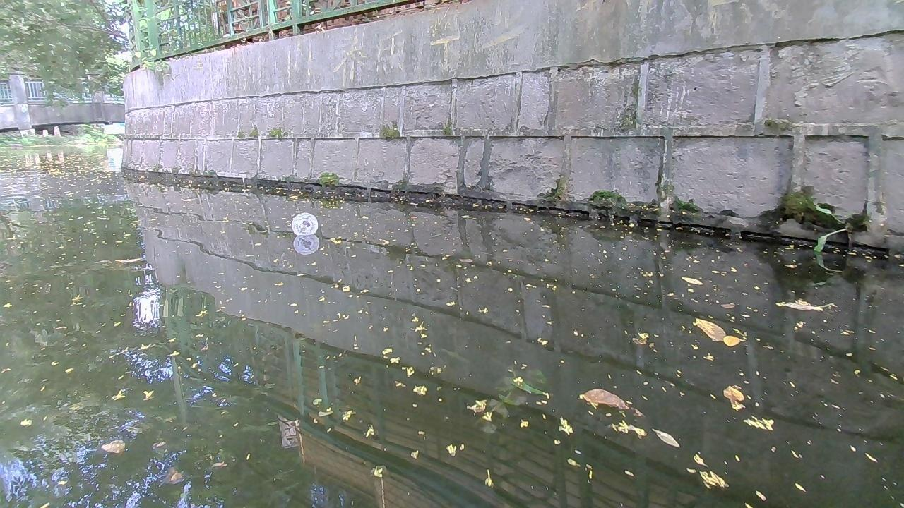
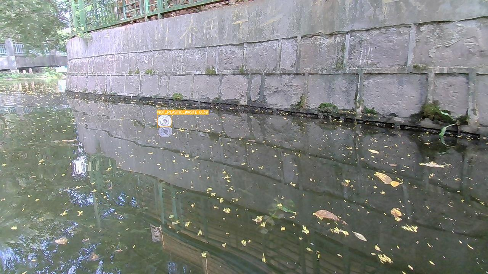
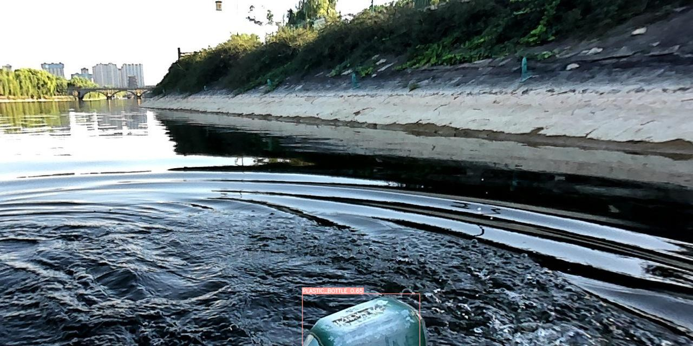
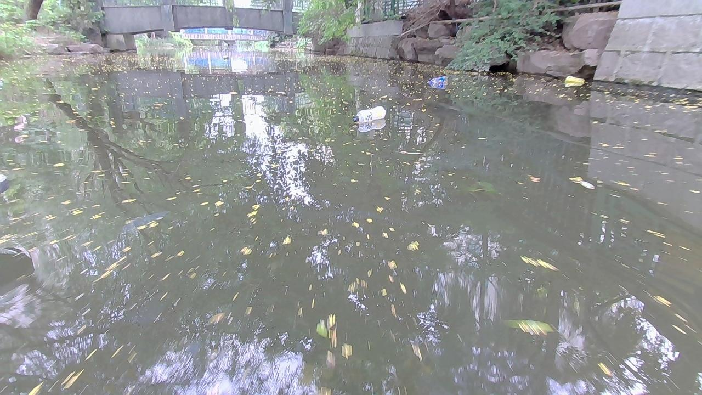
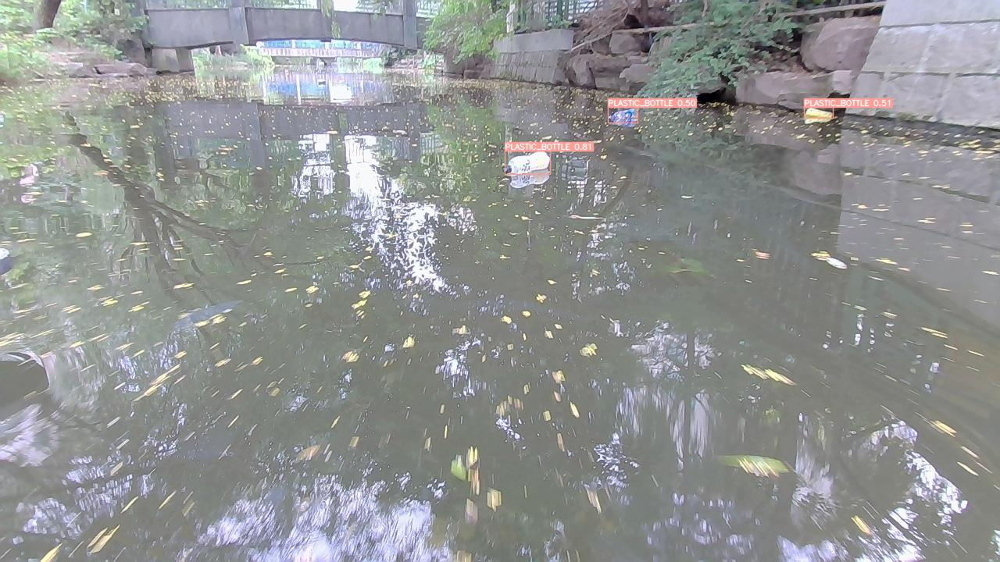

# Custom YOLO Model for Plastic Waste Detection in Rivers

This repository contains the code and resources to train a custom YOLOv8 (You Only Look Once) model for detecting plastic waste in river environments. The model is trained to identify plastic waste in river images and classify them in one of 'PLASTIC_BAG', 'PLASTIC_BOTTLE', 'OTHER_PLASTIC_WASTE', 'NOT_PLASTIC_WASTE' classes.

## Dataset
- `plastic_in_river` from [HuggingFace🤗](https://huggingface.co/datasets/kili-technology/plastic_in_river)
- Dataset has bounding box in normalised format as required for YOLO.
- 4 classes of waste `PLASTIC_BAG`, `PLASTIC_BOTTLE`, `OTHER_PLASTIC_WASTE`, `NOT_PLASTIC_WASTE`

## Training
- Configure the YOLO model parameters in the configuration file according to `plastic_in_river` dataset and requirements.
- Train the model using the provided scripts or customize them as needed.
- Monitor the training progress and adjust hyperparameters if necessary.

## Inference
- Some test images are tested and results are as below
    | Input Image | Output Image |
    |-------------|--------------|
    |  |  |
    |  |  |
    |  |  |

## Acknowledgements
- Dataset is provided from Kili's Community Challenge - Plastic in River dataset through HuggingFace🤗.
- Model YOLOv8 developed by [Ultralytics](https://docs.ultralytics.com/).
- Thanks [HuggingFace🤗](https://huggingface.co/datasets/kili-technology/plastic_in_river) for creating such an amazing open source platform. 

---
Feel free to explore, experiment, and contribute to this project for a cleaner and healthier environment! 🌏🌱♻️
